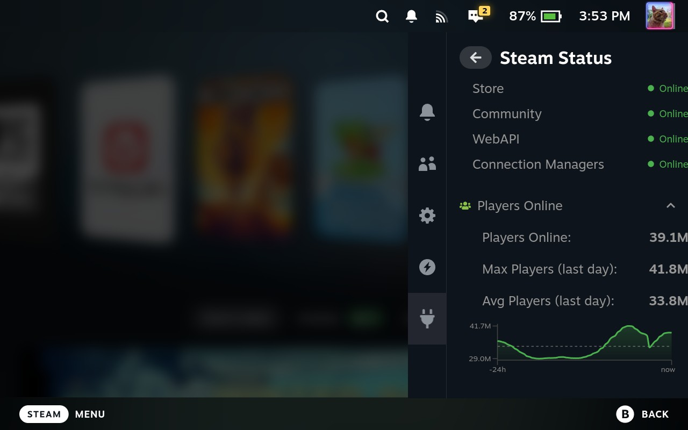
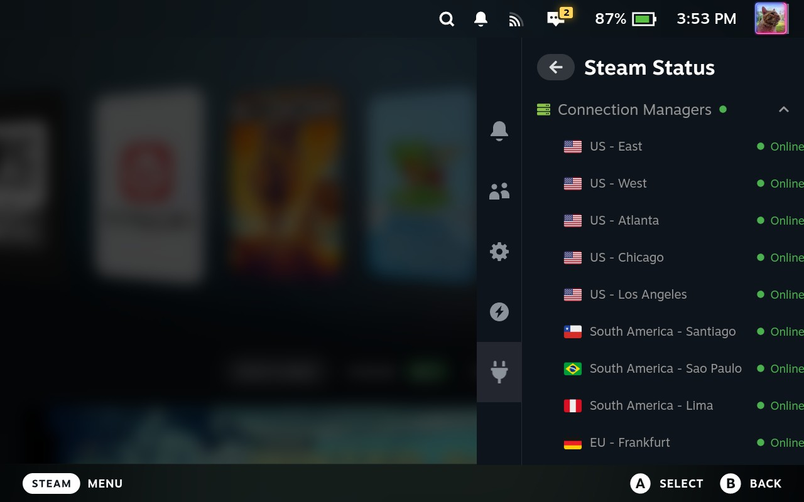
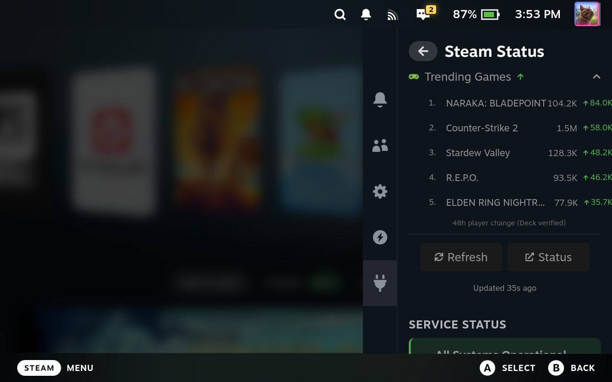
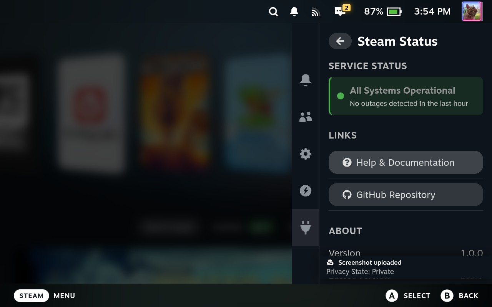
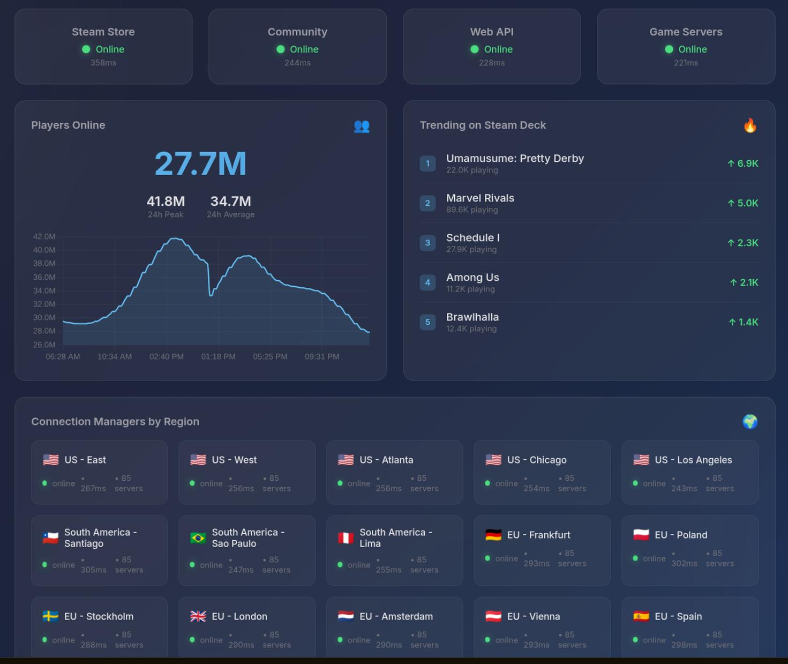

# Steam Status

<!-- Core status -->
<!-- -->
<!-- Platform -->

Display **real-time Steam status**, player counts, and Steam service health directly on your lovely Steam Deck.
This is getting information from official Steam APIs, and also from ProtonDB. (for Trending Games).

---

## What it does

Steam Status Decky is a Decky plugin which displays real-time information about Steam services, helping you know when Steam is experiencing issues. The plugin shows:

- **Current player count** - Total users currently logged into Steam
- **Service status** - Health of Steam Store, Community, and WebAPI
- **24-hour player history** - Sparkline graph showing player count trends
- **Regional server status** - Status of Steam servers by region
- **Trending games** - Top 5 Deck-verified games with biggest player gains
- **Outage detection** - Automatic detection and notifications for service outages

It's making use of a gateway server, developped, hosted and paid by me, so no Steam API is required.
The gateway server also has a status page, which can be viewed.

---

## What did I create this

In December 2025, we experienced several Steam service outages. During my active gaming session, issues were occuring in-game, without any clear indication that Steam itself was experiencing problems.
At the time, we didn't know whether these disruptions were caused by local issues or by a broader Steam service outage. (You know how it goes..."would a reboot resolve our issues").
This led me to realize that it would be (for me) highly beneficial to receive clear notifications when Steam services are experiencing problems, or to be able to view the current status of Steam directly, without having to interrupt gameplay or open a web browser to investigate the issue.

---

## Features & Options

- **History sparkline**: Visual graph of player counts over the last 24 hours
- **Regional status**: Expandable view of Steam servers by region (US East, US West, EU West, EU East, Asia)
- **Trending games**: Top 5 Deck-verified games currently gaining players
- **Outage notifications**: Get notified when Steam services go down or recover
- **Anti-flood protection**: Prevents notification spam during gateway or API issues
- **Network diagnostics**: Test Steam connection latency and internet speed
- **Configurable refresh interval**: Set automatic refresh from 3-10 minutes, or manual only
- **Status page link**: Quick access to external status page (default: https://store.steampowered.com/charts/)
- **Offline mode**: Displays cached data when the network is unavailable

---

## Screenshots

  
  

  
  

  

---

## Translations

The plugin supports localization and will automatically use Steam's language setting.
I used Google translate (is that AI or isn't it..) for the translations, so the translation could be completely wrong ;)

Pull requests for new translations are welcome.

---

## Compatibility & Testing

Tested on:
- **SteamOS 3.9** - Steam Deck LCD - Decky Loader v3.2.1

Steam Deck OLED has not been tested yet.

---

## Sponsoring

If you find this plugin useful and want to support its continued development, you can sponsor me.

Your support helps with:
- Maintenance and bug fixes
- New features and improvements
- Ability to develop new plugins

### Support the project

- **GitHub Sponsors**
  https://github.com/sponsors/bschelst
- **Ko-fi**
  https://ko-fi.com/bschelst
- **Buy Me a Coffee**
  https://www.buymeacoffee.com/bschelst

---

## Requirements

- Steam Deck or Linux PC/Bazzite using Steam Big Picture
- Decky Loader installed

Decky Loader:
https://github.com/SteamDeckHomebrew/decky-loader

---

## Installation (Decky Loader)

> The plugin is not available in the Decky Store **yet** and must be installed manually.

1. Download the **latest `.zip` release**:
   https://github.com/bschelst/steamstatus-decky/releases

2. Open **Game Mode** and launch **Decky Loader**.

3. Enable developer mode in Decky Loader if not enabled yet.

4. Go to **Decky Settings > Plugins > Install from ZIP**.

5. Select the downloaded `steamstatus-decky-<version>.zip`.

6. Restart Steam client.

The Steam status panel will appear in the Decky quick access menu.

### Updating

To update, install the latest ZIP via Decky Loader.
Existing settings are preserved.

---

## Disclaimer

This plugin is an independent, community-developed project and is **not affiliated with, endorsed by, or sponsored by Valve Corporation** or Steam.

Steam and the Steam logo are trademarks and/or registered trademarks of Valve Corporation in the U.S. and/or other countries.

All Steam status data is provided for informational purposes only.

---

